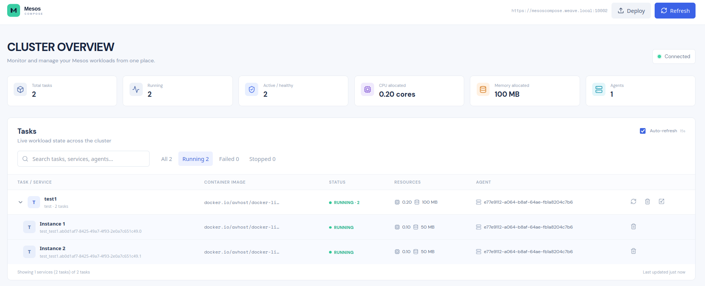
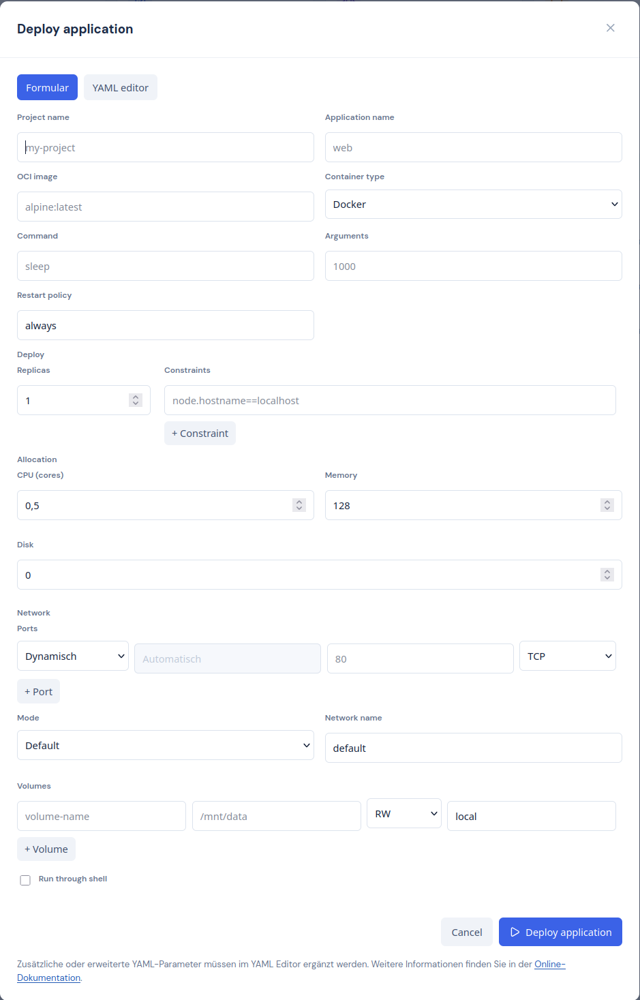
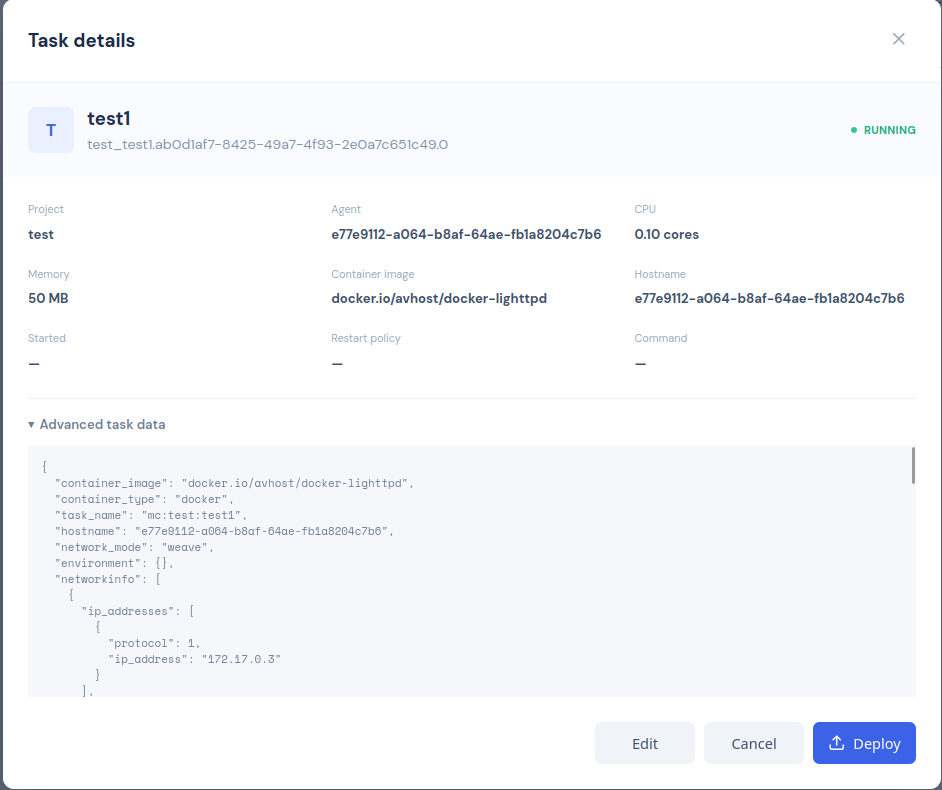

# Mesos Compose Frontend

React 19 + Vite dashboard for the mesos-compose v0 API. The UI is intentionally a separate project because the backend repository may be mounted read-only.

## Development

```bash
npm install
cp .env.example .env.local
npm run dev
```

Open the printed local URL. Enter the backend Basic Auth credentials in the login screen. Credentials are kept in `localStorage` so a page reload does not prompt again; they are never written to `.env`. Remove the browser's site data to clear the stored login.

## Configuration

`VITE_API_BASE_URL` defaults to `https://api.example.invalid:10002`; set it through the environment for the deployment.

The backend routes used are:

- `GET /api/compose/v0/tasks`
- `GET /api/compose/v0/events` (plain-text event stream)
- `DELETE /api/compose/v0/tasks/:taskid`
- `DELETE /api/compose/v0/:project/:service`
- `PUT /api/compose/v0/:project/:service/restart`
- `GET /api/compose/v0/:project` / `PUT /api/compose/v0/:project` (YAML body; scaling updates `services.<service>.deploy.replicas`)

## Production build

```bash
npm run build
npm run preview
```

The generated static artifact is in `dist/`. If the API uses a self-signed certificate, the browser must trust that certificate; the frontend does not disable TLS verification.

## screenshots




